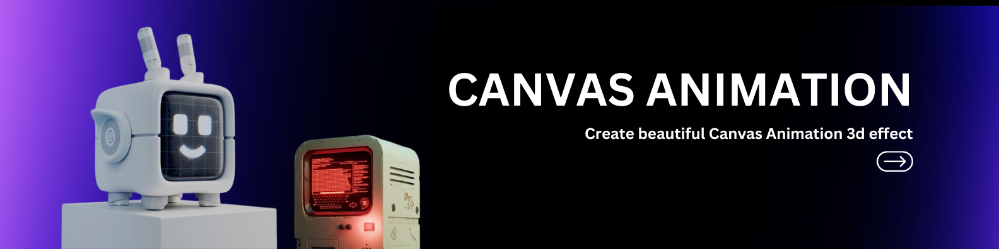
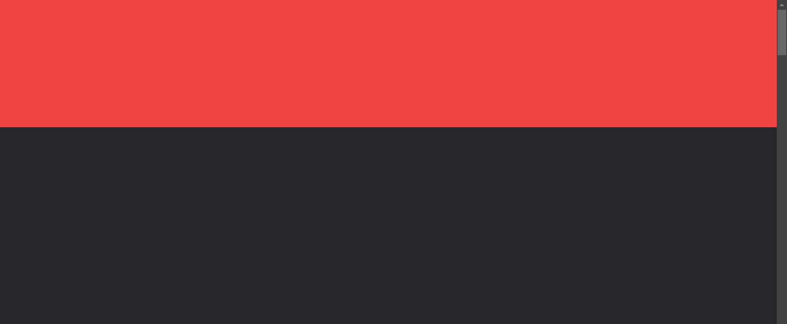
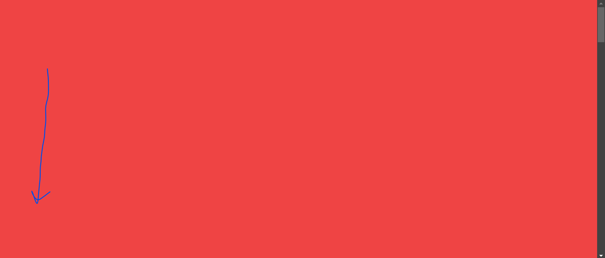
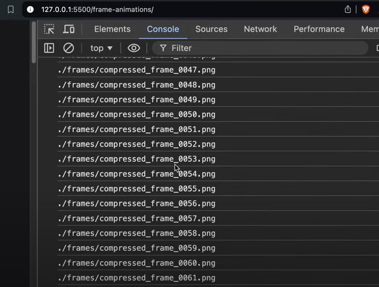
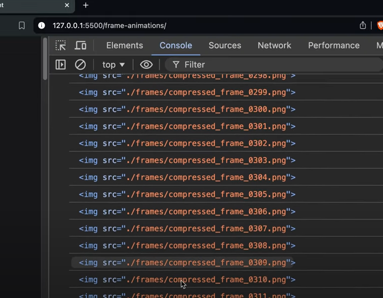
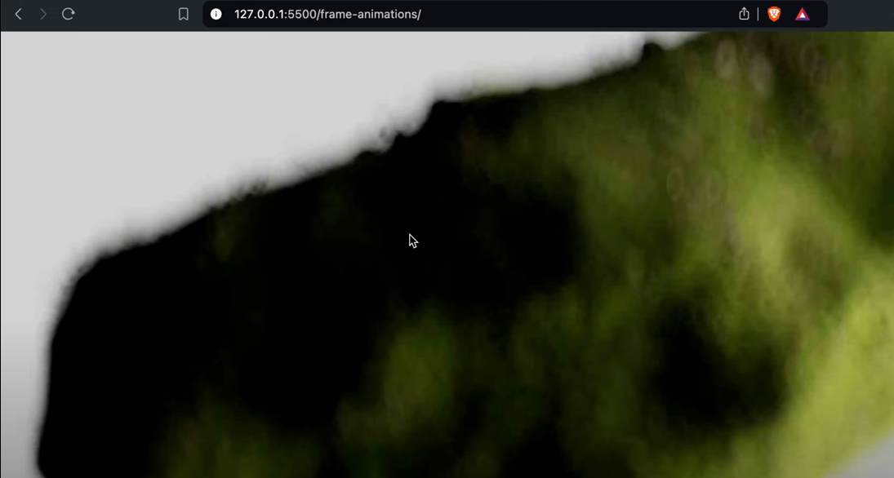

# Ultimate Canvas Website Animation



- follow me on linkedin `suryansh.`

## What is CANVAS:

### HTML5 Canvas is a feature of HTML5 that allows users to draw 2D shapes and bitmap images, interact with graphics on a page, and create animations

- in this we learn a scrollbased animtion of html 5 for making this effect we need some stuff
1. Frames [images]
2. green sock animation library
3. basic of javascript
4. ffmpeg software

# lets start 👌

## installisition part

- Install the ffmpeg [ you will get in this repo code ]

# Lets Play

as we want the animation happens on scroll based. so 1st we make a scroller div warpped with a parent. this scroller div is always sticky and scrolls over the parent div



---



```html
    <div class="w-full h-screen bg-zinc-900">
        <div class="parent relative top-0 left-0 w-full h-[700vh] bg-zinc-800">
            <div class="w-full sticky top-0 left-0 h-screen bg-red-500">
                <!-- here we write canvas having id and covers full screen-->
                 <canvas class="w-full h-screen" id="frame"></canvas>
            </div>
        </div>
    </div>
```

``` we remove `bg-zinc-800`, `bg-zinc-900` and `bg-red-500` at last these are only for your unterstanding ```

```html
<div class="w-full sticky top-0 left-0 h-screen bg-red-500">
```

`👁️ this will stick our scroller div to screen height so when we scroll its move over the wrapper which is 700vh height`

## PRELOADER 😎
As we have a bunch of images nearly [382] so we want that these images load first before scrolling its a good practice other wise our animation is laggy

### 1. Creating a preloader function

```javascript
<script>
        // create a frame obj 
        const frames = {
            currentIndex: 1,
            maxIndex: 382
        };

        // loading function
        function preloaderImages() {
            // generated url name for images 
            for(var i=0;i<=frames.maxIndex;i++){
                const imageUrl = `./frames/frame_${i.toString().padStart(4, "0")}.png`
            }
        }
    </script>
```

1. Configure Frame Settings: Modify the frames object to set the currentIndex and maxIndex based on your needs.
2. Preload Images: Call the preloaderImages function to generate the URLs for your images. from **0001 t0 0382**.



### 2. Creating IMG Tag and stores the src further we will check all images are loaded or not:



- Now inside loader funtion we make a new image and store the src into img tag from **0001 t0 0382** 

```javascript
<script>
        //create a frame obj 
        const frames = {
            currentIndex: 0,
            maxIndex: 382
        };

        // tracking how many images are loaded
        let imagesLoaded = 0;

        // loading function
        function preloaderImages() {
            for(var i=0;i<=frames.maxIndex;i++){
                const imageUrl = `./frames/compressed_frame_${i.toString().padStart(4, "0")}.png`;
                const img = new Image();
                img.src = imageUrl;
                //on loading images 
                img.onload = () =>{
                    imagesLoaded++;
                    if(imagesLoaded === frames.maxIndex) {
                        console.log("all images are loaded");
                        // startAnimation(); runs this fun after writing making it which is animte part at bottom of this repo 
                    }
                }
            }
        }

        preloaderImages();
    </script>
```

#### Here's a breakdown of how it works:

1. Create Image Objects: For each URL, it creates a new Image object and sets its src attribute to the generated URL. This triggers the browser to start loading the image.
2. Track Loaded Images: It adds an onload event listener to each image. When an image successfully loads, it increments the imagesLoaded counter.

- Check Completion: After incrementing the counter, it checks if the number of images loaded (imagesLoaded) matches the total number of images (frames.maxIndex). If so, it logs a message to the console indicating that all images have been loaded.

#### 3. after loading all the images we save the img tag into the array

```javascript
// from previous code 
const imageUrl = `./frames/compressed_frame_${i.toString().padStart(4, "0")}.png`;
const img = new Image();
img.src = imageUrl;
```
we have to save these images into the array 

```javascript
// creating array of images
        const images = [];
```
then after loading each img one by one we pust into the array

```javascript
//on loading images 
img.onload = () =>{
    imagesLoaded++;
    if(imagesLoaded === frames.maxIndex) {
        loadImage(frames.currentIndex);
    }
}
images.push(img); // saving images into images array variable
```

## LoadImage() Logic

```javascript
//LoadImage funtion logic
function loadImage(index){
    if(index >= 0 && index <= frames.maxIndex) {
        const img = images[index];
    }
}
```
- here `loadImage(index)` the index is come from `loadImage(frames.currentIndex);`from the above code as `preloaderImages()` runs 382 times so we get index from 0 to 382 and this indexes accept the varible of `loadImage(index)` index.

- checks whether a given index is within the valid range of image and its index should be positive

- `const img = images[index]` taking out the image from array of images `const images = []`

```html
const canvas = document.querySelector("canvas");
const context = canvas.getContext("2d");
```
- selecting the canavs and creating `context`
- `context` => The context provides the methods and properties needed to draw and manipulate images, shapes, text, and other visual elements on the canvas.

### Handling width, Height and scaling of canvas

```javascript
//LoadImage funtion logic
function loadImage(index){
    if(index >= 0 && index <= frames.maxIndex) {
        const img = images[index];

        // setting the w/h of canvas
        canvas.width = window.innerWidth,
        canvas.height = window.innerHeight

        // scaling
        const scaleX = canvas.width / img.width;
        const scaleY = canvas.height / img.height;
        //max scale
        const scale = Math.max(scaleX, scaleY);

        // creting new width and height so that our img take full canvas
        const newWidth = img.width * scale;
        const newHeight = img.height * scale;

        // crating center offset
        const offsetX = (canvas.width - newWidth) / 2;
        const offsetY = (canvas.height - newHeight) / 2;

    }
}
```
### Setting our Context 

- so now we tell the Context what to do, and How to do

1. cleaing the canvas from position (0,0) up to full witdth and height

```javascript
// clearing the canavs
context.clearRect(0, 0, offsetX, offsetY);
```

2. Setting image smoothing

```javascript
//sets image smoothing
context.imageSmoothingEnabled = true;
context.imageSmoothingQuality = "high";
```

3. drawing image on canavs from offsetX to offSetY upto newWidth and newHeight

```javascript
// drawing image on canavs from offsetX to offSetY upto newWidth and newHeight
context.drawImage(img, offsetX, offsetY, newWidth, newHeight);
frames.currentIndex = index;
```


- full code

```javascript
        //LoadImage funtion logic
        function loadImage(index){
            if(index >= 0 && index <= frames.maxIndex) {
                const img = images[index];

                // setting the w/h of canvas
                canvas.width = window.innerWidth,
                canvas.height = window.innerHeight

                // scaling
                const scaleX = canvas.width / img.width;
                const scaleY = canvas.height / img.height;
                //max scale
                const scale = Math.max(scaleX, scaleY);

                // creting new width and height so that our img take full canvas
                const newWidth = img.width * scale;
                const newHeight = img.height * scale;

                // crating center offset

                const offsetX = (canvas.width - newWidth) / 2;
                const offsetY = (canvas.height - newHeight) / 2;

                // clearing the canavs
                context.clearRect(0, 0, offsetX, offsetY);

                //sets image smoothing
                context.imageSmoothingEnabled = true;
                context.imageSmoothingQuality = "high";

                // drawing image on canavs from offsetX to offSetY upto newWidth and newHeight
                context.drawImage(img, offsetX, offsetY, newWidth, newHeight);
                frames.currentIndex = index;
            }
        }
```        

# BEST PART THE ANIMATION 😍

- 1st we trigger our `.parent` which is wrapper of sticky bc we scroll on parent not the sticky part then we animate it on the basis of scrolling

```javascript
function startAnimation() {
    // creating a timeline and triggers the .target class
    var tl = gsap.timeline({
        scrollTrigger: {
            trigger: ".parent",
            start: "top top",
            scrub: 2,
            markers: true
        }
    });
}
```

`
1. gsap.timeline(): Creates a new GSAP timeline. A timeline allows you to chain multiple animations together and control their sequencing.
ScrollTrigger Configuration:

2. scrollTrigger: An object passed to the timeline configuration that enables scroll-based animations. It specifies how the animation should interact with scrolling.
ScrollTrigger Properties:
`
----

```javascript
//animate
tl.to(frames, {
    currentIndex: frames.maxIndex,
    onUpdate: function () {
        loadImage(Math.floor(frames.currentIndex))
    }
})
```

### Breakdown

GSAP Timeline:

- `tl.to():` This method animates the frames object. The `to()` method is used to animate properties of the target object (frames in this case) from its current values to the specified values over time.
Target Object (frames):

- `frames:` This is the object being animated. It contains properties such as currentIndex and maxIndex.
Animation Properties:

- currentIndex: frames.maxIndex: Specifies that the currentIndex property of the frames object should animate from its current value to the value of frames.maxIndex. This means that as the animation progresses, currentIndex will gradually increase until it reaches maxIndex.
onUpdate Callback:

- onUpdate: This callback function is called on every update of the animation (i.e., as the animation progresses over time).
`function () { loadImage(Math.floor(frames.currentIndex)); }`: Inside this callback, loadImage is called with the current value of frames.currentIndex (rounded down to the nearest integer using Math.floor). This means that as the animation progresses and currentIndex changes, the loadImage function will be triggered to load images corresponding to the updated index.

### Understand the Purpose

- Animating Image Loading: This setup is useful for scenarios where you want to create a smooth transition between images based on the scroll or any other time-based animation. By animating `currentIndex`, you can control which image is currently visible or loaded in response to the animation progress.

- Loading Images Dynamically: The `onUpdate` callback ensures that each time the animation updates, a new image is loaded corresponding to the current `currentIndex.` This can be particularly useful for creating animations like a flipbook or a sprite sheet where images need to be sequentially loaded and displayed.

# Contribution

- Feel free to open issues or submit pull requests for improvements and bug fixes. or you can addyour more creativity we add in this repo😘

# Full code 😊

```javascript
<!DOCTYPE html>
<html lang="en">
<head>
    <meta charset="UTF-8">
    <meta name="viewport" content="width=device-width, initial-scale=1.0">
    <title>Master HTML 5 CANVAS. GITHUB -- suryansh-tech</title>
    <script src="https://cdn.tailwindcss.com"></script>
</head>
<body>
    
    <div class="w-full h-screen">
        <div class="parent relative top-0 left-0 w-full h-[700vh]">
            <div class="w-full target sticky top-0 left-0 h-screen">
                <!-- here we write canvas having id and covers full screen-->
                 <canvas class="w-full h-screen" id="frame"></canvas>
            </div>
        </div>
    </div>

   
    <script src="https://cdnjs.cloudflare.com/ajax/libs/gsap/3.12.5/gsap.min.js" integrity="sha512-7eHRwcbYkK4d9g/6tD/mhkf++eoTHwpNM9woBxtPUBWm67zeAfFC+HrdoE2GanKeocly/VxeLvIqwvCdk7qScg==" crossorigin="anonymous" referrerpolicy="no-referrer"></script>
    <script src="https://cdnjs.cloudflare.com/ajax/libs/gsap/3.12.5/ScrollTrigger.min.js" integrity="sha512-onMTRKJBKz8M1TnqqDuGBlowlH0ohFzMXYRNebz+yOcc5TQr/zAKsthzhuv0hiyUKEiQEQXEynnXCvNTOk50dg==" crossorigin="anonymous" referrerpolicy="no-referrer"></script>
    
    <script>
        const canvas = document.querySelector("canvas");
        const context = canvas.getContext("2d");

        //create a frame obj 
        const frames = {
            currentIndex: 0,
            maxIndex: 382
        };

        // tracking how many images are loaded
        let imagesLoaded = 0;

        // array of images
        const images = [];

        // loading function
        function preloaderImages() {
            for(var i=0;i<=frames.maxIndex;i++){
                const imageUrl = `./frames/frame_${i.toString().padStart(4, "0")}.jpg`;
                const img = new Image();
                img.src = imageUrl;
                //on loading images 
                img.onload = () =>{
                    imagesLoaded++;
                    if(imagesLoaded === frames.maxIndex) {
                        loadImage(frames.currentIndex);
                        startAnimation();
                    }
                }
                images.push(img);
            }
        }

        //LoadImage funtion logic
        function loadImage(index){
            if(index >= 0 && index <= frames.maxIndex) {
                const img = images[index];

                // setting the w/h of canvas
                canvas.width = window.innerWidth,
                canvas.height = window.innerHeight

                // scaling
                const scaleX = canvas.width / img.width;
                const scaleY = canvas.height / img.height;
                //max scale
                const scale = Math.max(scaleX, scaleY);

                // creting new width and height so that our img take full canvas
                const newWidth = img.width * scale;
                const newHeight = img.height * scale;

                // crating center offset

                const offsetX = (canvas.width - newWidth) / 2;
                const offsetY = (canvas.height - newHeight) / 2;

                // clearing the canavs
                context.clearRect(0, 0, offsetX, offsetY);

                //sets image smoothing
                context.imageSmoothingEnabled = true;
                context.imageSmoothingQuality = "high";

                // drawing image on canavs from offsetX to offSetY upto newWidth and newHeight
                context.drawImage(img, offsetX, offsetY, newWidth, newHeight);
                frames.currentIndex = index;
            }


        }

        // animate
        function startAnimation() {
            // creating a timeline and triggers the .target class
            var tl = gsap.timeline({
                scrollTrigger: {
                    trigger: ".parent",
                    start: "top top",
                    scrub: 2,
                    // markers: true
                }
            });

            //animate
            tl.to(frames, {
                currentIndex: frames.maxIndex,
                onUpdate: function () {
                    loadImage(Math.floor(frames.currentIndex))
                }
            })
        }

        preloaderImages()
    </script>


</body>
</html>
```


